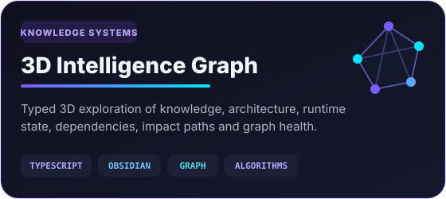
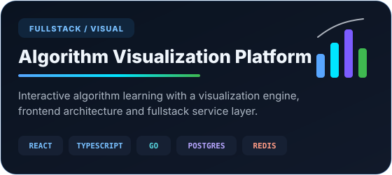

 

 
 

---

### I build systems where interface, data, automation and infrastructure meet.

**Real-time web applications · interactive visualization · fullstack services · Linux / Yocto engineering · local AI workflows**

HSE Software Engineering student, Class of 2027. Currently working with Linux / Yocto engineering at **YADRO / Radio Gigabit**.

---

## Featured engineering

 

### What these projects demonstrate

| Area | Engineering work |
| --- | --- |
| **Interactive systems** | Algorithm visualizers, canvas-driven UI, network topology interfaces, graph exploration and complex stateful interfaces |
| **Real-time systems** | WebSocket-driven dashboards, live state updates, monitoring surfaces and backend-integrated UI |
| **Linux / embedded** | Yocto Linux, reproducible build environments, system tooling, automation and embedded-oriented workflows |
| **AI / developer tooling** | Local AI workflows, context systems, observability, controlled execution and developer automation |

---

## Experience

**Yocto / Linux Development — YADRO / Radio Gigabit** · *May 2026 — Present*  
Working with Yocto Linux, reproducible build environments, embedded-oriented workflows, low-level tooling and Linux development automation.

**Fullstack Developer — YADRO / Radio Gigabit** · *November 2025 — May 2026*  
Built frontend and integration-heavy engineering tools with **React, MobX, Java / Spring**, real-time interfaces and Linux-oriented workflows.

**Frontend Developer — Neimark × YADRO, IoT / NMS** · *January 2025 — November 2025*  
Developed a network management system for microcontroller-based devices using **React, TypeScript, Redux Toolkit, React Query and PixiJS**, including interactive topology visualization and WebSocket-driven configuration.

<b>Earlier engineering experience</b>

 

**Technical Lead & Fullstack Developer** · *7 months*  
Led an interactive algorithm-learning platform with **React, React Konva, Go, Redis and PostgreSQL**, covering frontend architecture, backend services and visualization performance.

**Frontend Developer — T-Bank academic project** · *5 months*  
Worked on a lunch-partner matching service with a focus on UI/UX, performance and interaction flows.

**Freelance Frontend Developer** · *4 months*  
Built responsive websites, landing pages and Telegram applications with API integrations and automation.

---

## Core engineering stack

### Product & visualization

### Backend & data

### Systems & delivery

<b>Additional technologies I have worked with</b>

 

Java / Spring · Flask · C · C++ · PHP · SCSS · MUI · Framer Motion · React Konva · React Query · React Router · gRPC · Protocol Buffers · ESP-IDF · Vite · Webpack · GitLab · WordPress · Figma · React Native · WebAssembly · NumPy · Matplotlib

---

## GitHub activity

 

---

## Work with me

### Linux / local AI workflow diagnostic — **9,900 ₽**

If a repeated Linux or local-AI workflow keeps losing project context, producing hard-to-verify results, or requiring the same recovery work again and again, I can diagnose **one bounded workflow** on your workstation.

The diagnostic starts with an agreed problem, baseline, access boundary, deliverable and acceptance checks. The **9,900 ₽** fee is fully credited toward an optional **49,900 ₽ / five-working-day implementation pilot** covering one Linux workstation and up to three projects.

This is a founder-led service. External customer validation is still in progress, and I do not promise full autonomy or guaranteed time savings. Private files and credentials stay outside public case studies.

 
 

[**Service overview**](https://goringich.github.io/local-ai-os/?utm_source=github_profile&utm_medium=organic&utm_campaign=local_ai_diagnostic_20260908) · [**Scope & pricing**](https://github.com/goringich/local-ai-os/blob/main/docs/offer.md) · [**Delivery boundaries**](https://github.com/goringich/local-ai-os/blob/main/docs/proof-cohort.md)

---

## Education & contact

- **HSE — Software Engineering**, Class of 2027
- Open to selected remote engineering projects, open-source collaboration and technical discussions
- **Telegram:** [@a1gorithms](https://t.me/a1gorithms)
- **VK:** [gogotka](https://vk.com/gogotka)
- **GitHub:** [goringich](https://github.com/goringich)

 

**Build · observe · verify · improve**

Complex systems become useful when they are understandable, testable and recoverable.

