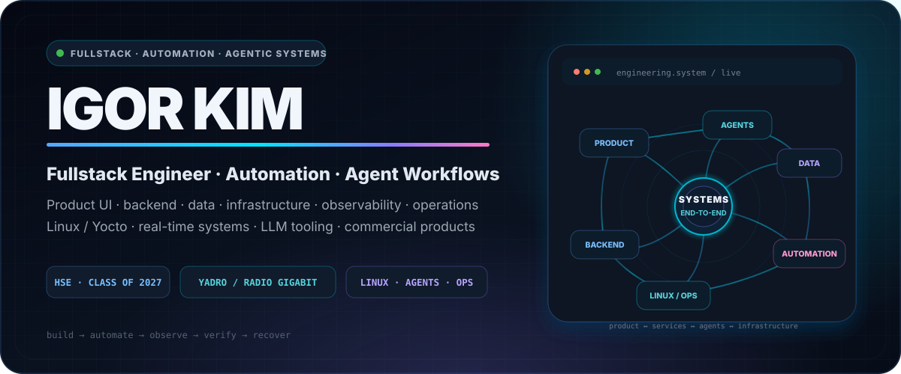
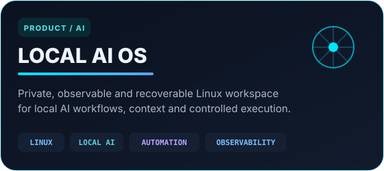
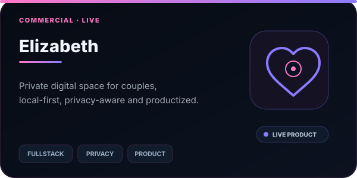
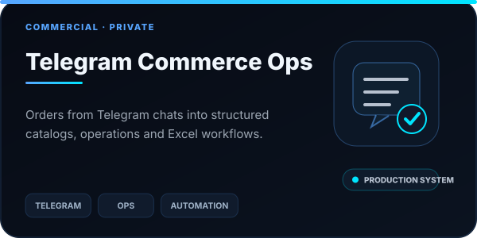
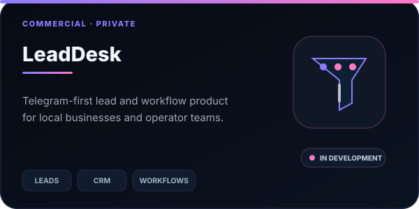
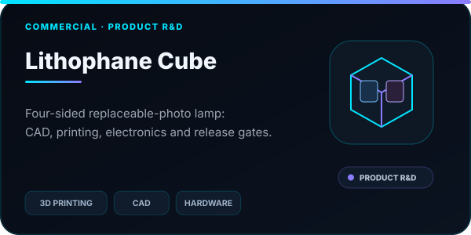
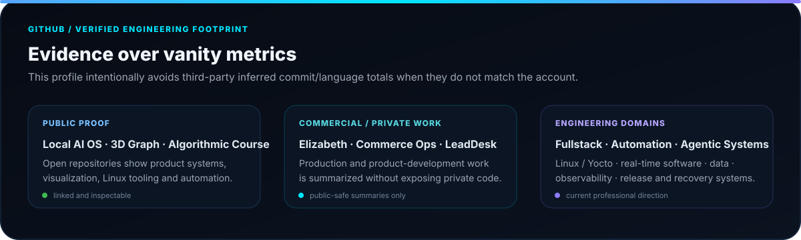
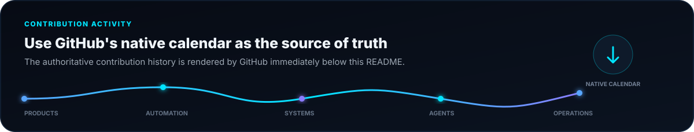

 

 

 
 

 
 

### Fullstack Engineer · Automation & Agentic Systems · HSE Software Engineering Student

I build **end-to-end product systems** across **web interfaces, backend services, data, Linux infrastructure, automation, observability, agent workflows and operations**.

I work with **LLM/agent orchestration, context and retrieval, local-model tooling and workflow automation** as engineering systems — not as an ML/model-training specialization.

<b>Product · backend · data · automation · agents · infrastructure · observability · operations</b>

 

[Professional Profile](#professional-profile--cv) · [Featured Engineering](#featured-engineering) · [Experience](#experience) · [Tech Stack](#tech-stack) · [GitHub](#github-overview) · [Work With Me](#work-with-me-one-linux--local-ai-workflow) · [Contact](#contact)

---

## Professional profile / CV

| | |
| --- | --- |
| **Current role** | Yocto / Linux Development at **YADRO / Radio Gigabit** |
| **Engineering direction** | Fullstack systems · automation · agentic/LLM workflows · Linux / Yocto · real-time systems · internal tooling |
| **Product scope** | Product UI · backend services · databases · APIs · CI/CD · observability · operations · commercial product development |
| **Education** | HSE, Faculty of Computer Science, Software Engineering, Class of 2027 |
| **Looking for** | Remote project-based work, open-source collaborations, engineering dashboards, internal tools, complex product and fullstack systems |

> I work end-to-end. Frontend engineering remains an important part of my background and experience, but my current positioning is broader: **fullstack product engineering, automation, agentic systems and Linux / Yocto engineering**.

### About Me

🎓 **Education:** HSE, Faculty of Computer Science, Software Engineering, Class of 2027

🚀 **Interests:** Web development, algorithms, performance optimization, interactive UI/UX, Linux systems, embedded engineering, local AI tooling, automation, agent workflows, product engineering

🌍 **Looking for:** Remote project-based work, open-source collaborations, engineering dashboards, internal tools, and complex frontend systems

⚙️ **Current focus:** Fullstack systems, commercial products, workflow automation, agentic/LLM tooling, Linux / Yocto, embedded workflows, observability, release/recovery engineering, and real-time systems

---

## Featured engineering

### Current commercial products and ventures

 

 

| Product | What I am building |
| --- | --- |
| **Local AI OS** | A productized Linux / local-AI workflow diagnostic and implementation offer with context recovery, verification, observability and automation. |
| **Elizabeth** | A live private digital space for couples: local-first, privacy-aware fullstack product with public acquisition, premium/payment flows and production deployment. |
| **Telegram Commerce Ops** | A private production system that turns Telegram orders into structured catalogs, operational workflows, administration and Excel exports. |
| **LeadDesk** | A Telegram-first service product for local businesses, focused on leads, operator workflows and structured business data. |
| **Lithophane Cube** | A physical-product engineering track: replaceable-photo lamp, parametric CAD, 3D printing, electronics and release/validation gates. |

### What these products demonstrate

| Area | Engineering work |
| --- | --- |
| **Product engineering** | Public funnels, fullstack applications, admin/operator surfaces, pricing and commercial delivery |
| **Automation & agentic systems** | LLM/agent workflows, context/retrieval, developer automation, controlled execution and verification |
| **Operational systems** | Telegram workflows, catalog/order processing, exports, admin tooling, observability and recovery |
| **Linux / infrastructure** | Yocto/Linux, deploy pipelines, containers, CI/CD, self-hosting, production operations |
| **Physical product R&D** | Parametric CAD, 3D printing, electronics boundaries and evidence-based release gates |

> Public repositories are linked where the code is intentionally public. Private production/commercial repositories are summarized without exposing private source code or secrets.

---

## Work with me: one Linux / local AI workflow

> [!IMPORTANT]
> **9,900 RUB diagnostic → optional 49,900 RUB five-working-day implementation pilot.** The diagnostic fee is fully credited toward the pilot.

Have a recurring problem recovering project context, finding answers in private notes, or checking a local AI workflow? I offer a **9,900 RUB diagnostic** for one workflow on your Linux workstation.

We agree the problem, baseline, access boundaries, deliverable and acceptance checks before payment. The diagnostic fee is fully credited toward an optional **49,900 RUB, five-working-day implementation pilot** covering one Linux workstation and up to three projects. Scope and timing are agreed before work starts.

This is a founder-led service. External customer validation is still in progress; there is no promise of full autonomy or guaranteed time savings. Private files and credentials stay outside public case studies.

 
 

**[Discuss your workflow on Telegram](https://t.me/a1gorithms?text=LOCAL%20AI%20OS%20%2F%20diagnostic-2026-07%20%7C%20source%3Dgithub-profile-20260908)** — describe the task you repeat, what currently fails, and your deadline. No credentials needed for the first conversation. Russian and English enquiries welcome.

[Service overview](https://goringich.github.io/local-ai-os/?utm_source=github_profile&utm_medium=organic&utm_campaign=local_ai_diagnostic_20260908) · [Scope and pricing](https://github.com/goringich/local-ai-os/blob/main/docs/offer.md) · [Delivery and acceptance boundaries](https://github.com/goringich/local-ai-os/blob/main/docs/proof-cohort.md)

---

## Experience

### 🏆 Yocto / Linux Development at YADRO / Radio Gigabit
**May 2026 - Present**

Currently working with **Yocto Linux**, reproducible build environments, embedded-oriented workflows, low-level tooling, and Linux development automation.

### 🏆 Fullstack Developer at YADRO / Radio Gigabit
**November 2025 - May 2026**

Worked on fullstack engineering tasks, focusing on frontend (**React, MobX**) development, backend integration (**Java Spring**), real-time interfaces, Linux-oriented workflows, and internal engineering tools.

### 🏆 Frontend Developer at Neimark & YADRO (IoT Project)
**January 2025 - November 2025**

Developed a **network management system (NMS)** for microcontroller-based devices with real-time monitoring and control via **React + TypeScript + Redux Toolkit + React Query + PixiJS**. Designed **interactive network topology visualization** and implemented **dynamic configuration panels with WebSocket updates**.

### 🏆 Technical Lead & Fullstack Developer
**7 months**

Led the development of an **interactive web course with an algorithm visualization engine**, managing both frontend (**React, React Konva**) and backend (**Go, Redis, PostgreSQL**) architecture. Designed system architecture, optimized performance, and ensured seamless user interactions.

### 🏆 Frontend Developer at T-Bank (Academic Project)
**5 months**

Contributed to the development of a **lunch partner matching service**, focusing on UI/UX design, performance optimization, and smooth user interaction flows.

### 🏆 Freelance Frontend Developer
**4 months**

Developed **responsive landing pages and multi-page websites**, ensuring high-quality layouts, SEO optimization, and cross-browser compatibility. Built **Telegram applications** with bot automation, API integrations, and optimized UI/UX.

---

## What I build

| Product systems | Automation & agentic systems | Systems & infrastructure |
| --- | --- | --- |
| Fullstack services | LLM / agent workflows | Linux / Yocto workflows |
| Real-time monitoring dashboards | Developer automation | Embedded-adjacent tools |
| Algorithm visualizers | Local AI tooling | Observability and operations |
| Network topology interfaces | Telegram Mini Apps | CI/CD and release systems |
| High-performance React apps | Context / retrieval workflows | 3D printing prototypes |
| UI systems and design systems | Workflow integration and orchestration | Deployment and recovery tooling |

---

## Current focus

---

## Tech stack

### Automation, agents and developer systems

### Web and interface engineering

### Backend and databases

### APIs and communication

### Linux, embedded and systems

### Tools and platforms

### Additional experience

---

## GitHub overview

 
 

<a href="https://github.com/goringich/local-ai-os">Local AI OS</a> ·
<a href="https://github.com/goringich/3d-graph-improvements-">3D Intelligence Graph</a> ·
<a href="https://github.com/goringich/algorithmic-web-course">Algorithmic Web Course</a> ·
<a href="https://github.com/goringich/ESP32-P4-M3">ESP32-P4-M3</a> ·
<a href="https://github.com/goringich/my-custom-cachyos-iso">Custom CachyOS ISO</a>

> The previous third-party GitHub totals and language-percentage cards were removed because they were demonstrably inconsistent for this account. The profile now keeps live GitHub/Shields counters only where the meaning is clear, and uses repository links plus GitHub's native contribution calendar as the source of truth.

---

## Contribution activity

---

## Contact

 
 

### Thanks for visiting my profile

I am open to interesting projects, open-source collaboration, and technical discussions.

 

**Build · automate · observe · verify · recover · improve**

Complex systems become useful when they are understandable, testable and recoverable.

